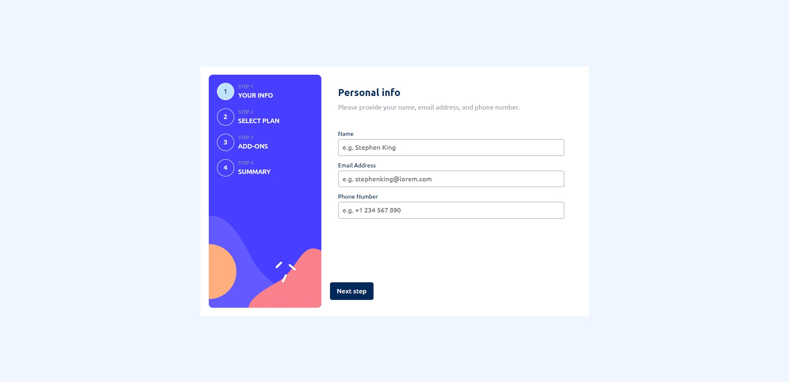

# Frontend Mentor - Multi-step form


This is a solution to the [Multi-step form challenge on Frontend Mentor](https://www.frontendmentor.io/challenges/multistep-form-YVAnSdqQBJ). Frontend Mentor challenges help you improve your coding skills by building realistic projects. 

## Table of contents

- [Overview](#overview)
  - [The challenge](#the-challenge)
  - [Screenshot](#screenshot)
  - [Links](#links)
- [My process](#my-process)
  - [Built with](#built-with)
  - [What I learned](#what-i-learned)
  - [Continued development](#continued-development)
  - [Useful resources](#useful-resources)
- [Author](#author)


## Overview

### The challenge

Users should be able to:

- Complete each step of the sequence
- Go back to a previous step to update their selections
- See a summary of their selections on the final step and confirm their order
- View the optimal layout for the interface depending on their device's screen size
- See hover and focus states for all interactive elements on the page
- Receive form validation messages if:
  - A field has been missed
  - The email address is not formatted correctly
  - A step is submitted, but no selection has been made

  ### Screenshot



### Links

- Solution URL: [Add solution URL here](https://github.com/nevredimiy/frontendMentor-Multi-stepFormSolution.git)
- Live Site URL: [Add live site URL here](https://your-live-site-url.com)

## My process

### Built with

- Semantic HTML5 markup
- CSS custom properties
- Flexbox
- CSS Grid
- Mobile-first workflow
- [React](https://reactjs.org/) - JS library
- Base hooks: useState, useContext, useRef

### What I learned

I used new hook for me it is **useContext**. I combinet it with **useState**


```js
export const dataMFContext = React.createContext();
...
...
const [dataTotal, setDataTotal] = React.useState({ ... });
<dataMFContext.Provider value={{ dataTotal, setDataTotal }}>
  {conditionalComponent()}
</dataMFContext.Provider>
```

### Continued development

On other projects, I would like to explore the Redux example.

### Useful resources

- [Example resource 1](https://blog.logrocket.com/build-multi-step-form-usestate-hook/) - This is an amazing article which helped me used hook useState
- [Example resource 2](https://react.dev/reference/react/useContext) - Article about useContext
- [Example resource 3](https://blog.webdevsimplified.com/2020-06/use-context/) - Another article about hook useContext


## Author

- Website - [Artem](https://writecode6.wordpress.com/%d0%be%d0%b1%d0%be-%d0%bc%d0%bd%d0%b5/)
- Frontend Mentor - [@nevredimiy](https://www.frontendmentor.io/profile/nevredimiy)
- Youtube - [@write-code](https://studio.youtube.com/channel/UCnmIQSMt8ayFgE2deKtAaKQ)

